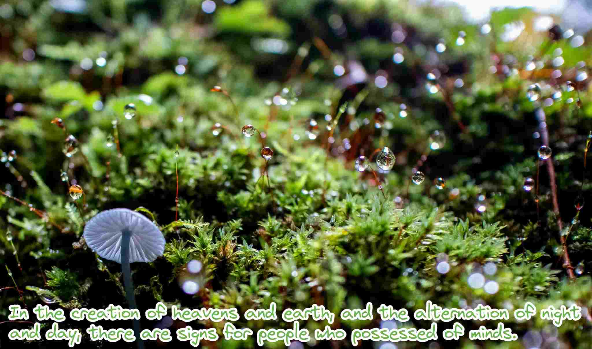

<!-- insert image -->

### Hi there 👋
<!-- **bagustris/bagustris** is a ✨ _special_ ✨ repository because its `README.md` (this file) appears on your GitHub profile. -->
- 🔭 I’m currently researching and teaching acoustic, vibration, and signal processing
- 💬 This account is mainly intended to host repositories to accompany them
- 👯 I am looking for collaborators on those subjects 
- 📫 How to reach me: [Twitter](https://twitter.com/btatmaja) or [Email](mailto:bagus@ep.its.ac.id)
-  ✨ **Please mention me with `@bagustris` when creating issues in my repos!**

### Recent writings
<!-- BLOG-POST-LIST:START -->
- [Siapa Pencipta Tuhan](https://bagustris.blogspot.com/2024/03/siapa-pencipta-tuhan.html)
- [Membuat Alias untuk Github Copilot CLI](https://bagustris.blogspot.com/2024/03/membuat-alias-untuk-github-copilot-cli.html)
- [Menggunakan &lpar;Mini&rpar; Conda Untuk Komersial &lpar;Institusi Riset, dll&rpar;](https://bagustris.blogspot.com/2024/03/menggunakan-mini-conda-untuk-komersial.html)
- [Laporan Bulanan Januari 2024](https://bagustris.blogspot.com/2024/01/laporan-bulanan-januari-2024.html)
- [Mencoba Obsidian: note-taking app yang super powerful](https://bagustris.blogspot.com/2023/12/mencoba-obsidian-note-taking-app-yang.html)
<!-- BLOG-POST-LIST:END -->

### My Github Stats

<!-- - 🤔 I’m looking for help with ... 
- 💬 Ask me about ...
- 😄 Pronouns: ...
- ⚡ Fun fact: ... 
- 🌱 I’m currently also learning and teaching on those subjects 🔭 -->

<!--
I am currently learning, teaching, and researching ~speech~ sound processing. Below are my repositories; most of them were made to accompany my research papers. Feel free to open issues and make pull requests. I will be happy if you wanna collaborate with me, in all areas. Reach me by email or Twitter.
-->
