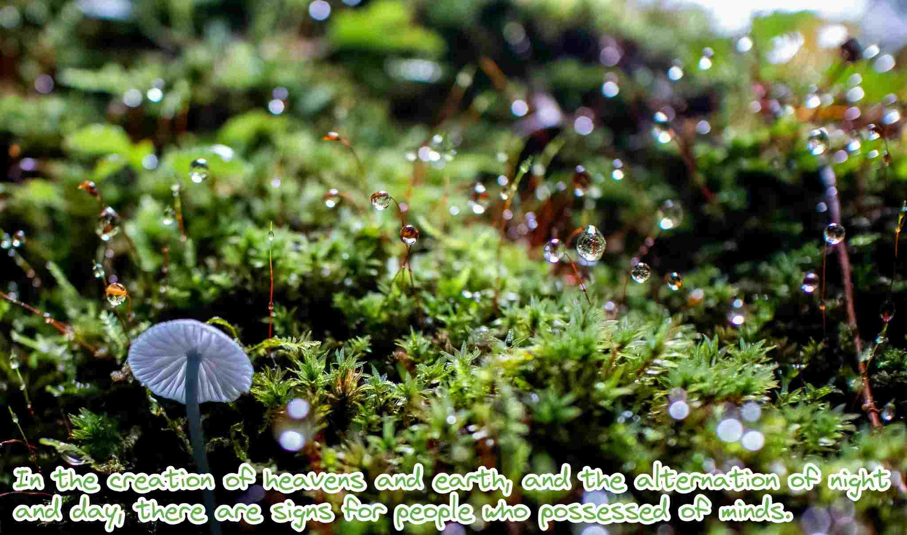

<!-- insert image -->
<!---->

### Hi there 👋
<!-- **bagustris/bagustris** is a ✨ _special_ ✨ repository because its `README.md` (this file) appears on your GitHub profile.⚠️ -->
- 🔭 I’m currently researching ~~and teaching acoustic, vibration, and signal~~ speech processing
- 💬 This account is mainly intended to host repositories to accompany them
- 👯 I am looking for collaborators on those subjects 
- 📫 How to reach me: [Twitter](https://twitter.com/btatmaja) or [Email](mailto:btatmaja@gmail.com)
-  :warning: **Please mention me with `@bagustris` when creating issues in my repos!**

### Recent writings
<!-- BLOG-POST-LIST:START -->
- [Dua tipe riset: Curiosity-driven vs. Mission oriented](https://bagustris.blogspot.com/2026/03/dua-tipe-riset-curiosity-driven-vs.html)
- [Numpy Tingkat Lanjut](https://bagustris.blogspot.com/2019/04/numpy-tingkat-lanjut.html)
- [Interval walking di musim dingin](https://bagustris.blogspot.com/2026/01/interval-walking-di-musim-dingin.html)
- [Fix Japanese garbled character](https://bagustris.blogspot.com/2026/01/fix-japanese-garbled-character.html)
- [Permasalahan smartwach &lpar;The problem with smartwatch&rpar;](https://bagustris.blogspot.com/2026/01/permasalahan-smartwach-problem-with.html)
<!-- BLOG-POST-LIST:END -->

<!--### My Github Stats

-->

<!--## GitHub Stats-->

<!--## Top Languages

-->
<!-- - 🤔 I’m looking for help with ... 
- 💬 Ask me about ...
- 😄 Pronouns: ...
- ⚡ Fun fact: ... 
- 🌱 I’m currently also learning and teaching on those subjects 🔭 -->

I am currently learning, teaching, and researching speech/sound processing. Below are my repositories; most of them were made to accompany my research papers. Feel free to open issues and make pull requests. I will be happy if you wanna collaborate with me, in all areas. Please reach out to me by email.

